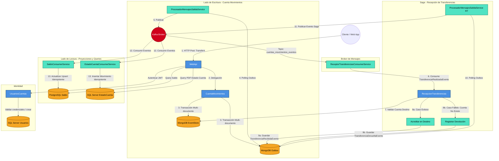
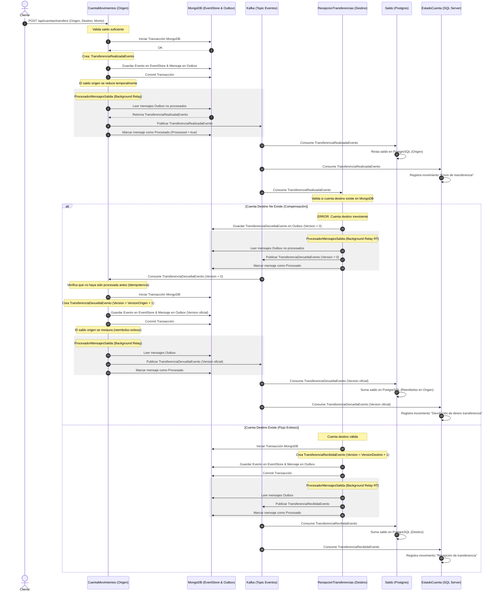

# Algunas estadísticas

## Pulls de microservicios
### Portal react


### Servicio cuentas movimientos


### Servicio recepción transferencias


### Servicio saldo


### Servicio estado de cuenta


### Vistas del perfil de github


# 🏦 Demo de Microservicios Bancarios - Event Sourcing & CQRS

Este repositorio es una demostración técnica de una arquitectura distribuida de alto rendimiento para la gestión de operaciones bancarias. El proyecto implementa un ecosistema de microservicios utilizando **.NET 10**, enfocado en la trazabilidad absoluta, la inmutabilidad de los datos, la resiliencia del sistema y la **observabilidad distribuida en tiempo real**.

---

## 🏗️ Arquitectura y Patrones de Diseño

El sistema se basa en una arquitectura **Event-Driven**, separando las responsabilidades de escritura y lectura (CQRS) para optimizar la escalabilidad y la integridad de los datos.

### Patrones Implementados:
* **Event Sourcing:** La fuente de verdad reside en un historial inmutable de eventos almacenado en **MongoDB**. Esto permite reconstruir el estado financiero de cualquier cuenta bancaria en cualquier punto del tiempo.
* **CQRS (Command Query Responsibility Segregation):** Modelos de datos independientes para operaciones de escritura (MongoDB) y lectura (PostgreSQL y SQL Server), permitiendo que cada lado escale de forma autónoma.
* **Transactional Outbox:** Garantiza la consistencia atómica entre el Event Store y el Message Broker. Asegura que cada cambio de estado y su mensaje de outbox se persistan en la misma transacción en MongoDB, eliminando el problema del "Dual Write".
* **Event-Driven Projections:** Los servicios de lectura (Saldo y Estado de Cuenta) reaccionan de forma coreografiada a los eventos publicados en el bus para actualizar sus propios almacenes de datos optimizados para queries.
* **Saga por Coreografía:** Coordina transferencias entre cuentas mediante transacciones compensatorias. Si la cuenta destino no existe o está inactiva, se emite un `TransferenciaDevueltaEvento` para retornar de forma segura los fondos a la cuenta de origen.
* **Distributed Tracing (Observabilidad):** Monitoreo unificado de transacciones asíncronas cruzando fronteras de red mediante el estándar de **OpenTelemetry** y el contexto de propagación W3C.

---

## 🛡️ Resiliencia, Consistencia y Trazabilidad

A diferencia de implementaciones convencionales, este proyecto resuelve retos críticos de los sistemas distribuidos mediante el patrón **Outbox** y el rastreo de transacciones complejas:

1. **Atomicidad:** Se utilizan **Transacciones de MongoDB** para asegurar que el evento de dominio y el mensaje en el Outbox se persistan como una única unidad atómica.
2. **At-Least-Once Delivery:** Un servicio en segundo plano (`ProcesadorMensajesSalidaService`) actúa como relay, monitoreando la colección y garantizando la entrega a **Kafka**.
3. **Idempotencia:** Los consumidores en el lado de lectura (PostgreSQL y SQL Server) están diseñados para procesar mensajes basándose en la versión del evento, evitando inconsistencias por duplicidad.
4. **Trace Propagation asíncrona:** El contexto de telemetría original (`TraceId`) se extrae de la base de datos Mongo, se propaga inyectado en arreglos binarios (`byte[]`) en las cabeceras nativas de **Kafka Message Headers**, y es extraído por el consumidor de lectura para enlazar las consultas de **Dapper**, cerrando el ciclo de monitoreo ciego en procesos asíncronos.

---

## 🗺️ Diagrama de Arquitectura y Flujos

### Diagrama de Componentes y Capas (CQRS & Outbox)


### Diagrama de Secuencia de la Saga (Flujo de Devolución)


---

## 📊 Observabilidad Distribuida

El ecosistema entero está instrumentado de manera nativa sin recurrir a llamadas acopladas tradicionales de .NET 10. El flujo de datos en el monitor visual se observa de la siguiente manera:

* **Petición HTTP Front (React -> WebApi):** Inicia la traza transaccional raíz.
* **Mongo Persistence:** Captura el tiempo de inserción en el EventStore y Outbox.
* **Kafka Boundary:** El Relay captura el mensaje, le inyecta las cabeceras de diagnóstico y calcula la latencia del bus.
* **Consumer & Dapper:** El consumidor revive la traza hija exacta, calculando el impacto de rendimiento de las sentencias SQL en PostgreSQL o SQL Server.

---

## 🛠️ Stack Tecnológico

| Capa | Tecnología |
| :--- | :--- |
| **Runtime** | .NET 10 (C# 14 con Top-Level Statements modernos) |
| **Event Store** | MongoDB (Replica Set para soporte de Transacciones) |
| **Message Broker** | Apache Kafka (Confluent Kafka SDK) |
| **Read Side (Saldo)** | PostgreSQL + Dapper |
| **Read Side (Reportes)** | SQL Server + Dapper |
| **Gestión de Usuarios** | SQL Server + Dapper |
| **Observabilidad** | OpenTelemetry Core SDK + W3C TextMapPropagator |
| **Ingesta de Trazas** | OpenTelemetry Collector Contrib |
| **Visualizador de Telemetría**| Jaeger UI (All-in-one distributed tracing) |
| **Generación de Estado de cuenta**| QuestPDF |

---

## 🗄️ Inicialización de Bases de Datos (SQL Schemas)

Para desplegar los almacenes de datos del lado de lectura y de seguridad, ejecuta los siguientes scripts en tus servidores correspondientes:

### 1. PostgreSQL: Base de Datos de Saldos (`bd_saldos`)
Crea el esquema y la tabla para la proyección del saldo en tiempo real:

```sql
-- Crear esquema
CREATE SCHEMA IF NOT EXISTS cuentas;

-- Crear tabla de saldos
CREATE TABLE IF NOT EXISTS cuentas.saldos_cuenta (
    id UUID PRIMARY KEY,
    saldo NUMERIC(18, 2) NOT NULL DEFAULT 0.00,
    ultima_version INT NOT NULL DEFAULT 0,
    ultima_actualizacion TIMESTAMP WITH TIME ZONE DEFAULT CURRENT_TIMESTAMP
);
```

### 2. SQL Server: Base de Datos de Estados de Cuenta (`bd_estado_cuenta`)
Crea la tabla que almacena el historial detallado de movimientos de las cuentas:

```sql
CREATE TABLE MovimientosCuenta (
    Id BIGINT IDENTITY(1,1) PRIMARY KEY,
    AggregateId UNIQUEIDENTIFIER NOT NULL,
    TipoMovimiento NVARCHAR(100) NOT NULL,
    Monto DECIMAL(18, 2) NOT NULL,
    Version INT NOT NULL,
    FechaEvento DATETIME NOT NULL DEFAULT GETDATE(),
    MotivoDevolucion NVARCHAR(250) NULL
);

-- Crear índice para consultas rápidas de estado de cuenta
CREATE INDEX IX_MovimientosCuenta_AggregateId ON MovimientosCuenta(AggregateId);
```

### 3. SQL Server: Base de Datos de Usuarios (`bd_usuarios`)
Crea la tabla que gestiona las identidades y credenciales de los clientes:

```sql
CREATE TABLE TblCuentasUsuario (
    Id UNIQUEIDENTIFIER PRIMARY KEY,
    IdCuenta UNIQUEIDENTIFIER NOT NULL UNIQUE,
    Propietario NVARCHAR(250) NOT NULL,
    FechaHoraCreacion DATETIMEOFFSET NOT NULL,
    FechaHoraModificacion DATETIMEOFFSET NOT NULL,
    Estatus INT NOT NULL DEFAULT 1, -- 1: Activo, 0: Inactivo
    Usuario NVARCHAR(150) NOT NULL UNIQUE,
    Secreto NVARCHAR(250) NOT NULL
);
```

---

## 📋 Requisitos e Instalación

### 1. Levantar Infraestructura con Docker
El proyecto incluye un archivo `docker-compose.yml` que levanta Jaeger, el colector de OpenTelemetry y Apache Kafka. Ejecútalo en el directorio raíz:

```bash
docker-compose up -d
```

### 2. Configurar MongoDB como Replica Set
> [!IMPORTANT]
> El EventStore hace uso de transacciones multi-documento de MongoDB. MongoDB requiere de forma obligatoria que el servidor esté configurado como **Replica Set** para permitir transacciones.
> 
Si tu MongoDB local no está configurado como tal, puedes iniciarlo con la bandera `--replSet rs0` y ejecutar en el shell de Mongo:
```javascript
rs.initiate()
```

### 3. Configurar Cadenas de Conexión
Asegúrate de configurar los archivos `appsettings.json` de cada microservicio con las credenciales correspondientes para MongoDB, PostgreSQL, SQL Server y la dirección IP del broker de Kafka (`localhost:9092`).

---

## 📁 Estructura del Proyecto

* **`Isra.Demos.Microservicios.WebApi`**: Punto de entrada y gestión de consultas rápidas. Consume de los almacenes de lectura (Postgres y SQL Server).
* **`Isra.Demos.Microservicios.CuentaMovimientos`**: Lado de comandos (Depósitos, Retiros e Inicio de Transferencias) mediante Event Sourcing. Escribe en MongoDB y encola en el Outbox.
* **`Isra.Demos.Microservicios.RecepcionTransferencias`**: Microservicio encargado de recibir y procesar las transferencias entrantes asíncronamente a través de Kafka, aplicando validaciones del lado receptor y coordinando el éxito o reverso de la Saga.
* **`Isra.Demos.Microservicios.Saldo`**: Consumidor de eventos que actualiza de manera idempotente la tabla de PostgreSQL (`saldos_cuenta`).
* **`Isra.Demos.Microservicios.EstadoCuenta`**: Consumidor de eventos que almacena el historial detallado de transacciones en SQL Server y genera reportes PDF mediante QuestPDF.
* **`Isra.Demos.Microservicios.UsuariosCuentas`**: API que gestiona identidades, valida la unicidad de usuarios en la base de datos relacional y gestiona el flujo de inicio de sesión entregando tokens JWT.

---

## 🔍 Notas Adicionales sobre el Proyecto
* **Formato de Solución Extensible:** El proyecto hace uso del formato moderno de solución `.slnx` soportado por las versiones recientes de Visual Studio y el ecosistema .NET, manteniendo la configuración limpia y libre de metadatos XML redundantes.

