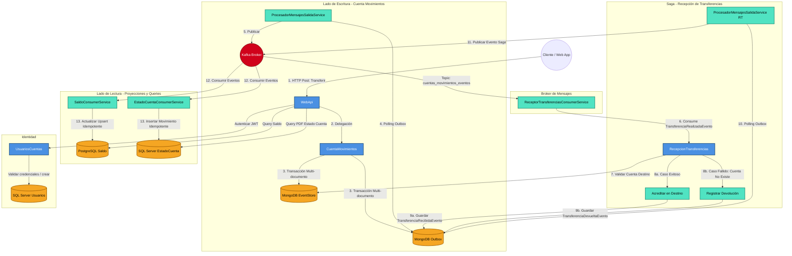
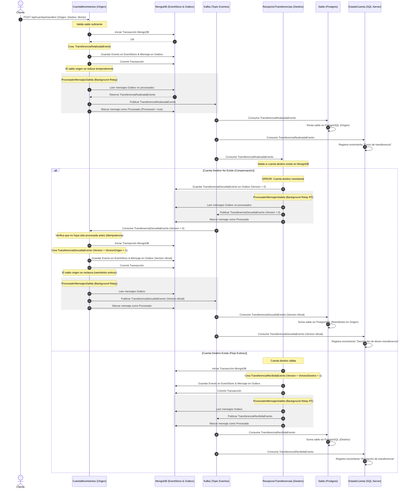

# Algunas estadísticas

## Pulls de microservicios
### Portal react


### Servicio cuentas movimientos


### Servicio recepción transferencias


### Servicio saldo


### Servicio estado de cuenta


### Vistas del perfil de github


# 🏦 Demo de Microservicios Bancarios - Event Sourcing & CQRS

Este repositorio es una demostración técnica de una arquitectura distribuida de alto rendimiento para la gestión de operaciones bancarias. El proyecto implementa un ecosistema de microservicios utilizando **.NET 10**, enfocado en la trazabilidad absoluta, la inmutabilidad de los datos y la resiliencia del sistema.

## 🏗️ Arquitectura y Patrones de Diseño

El sistema se basa en una arquitectura **Event-Driven**, separando las responsabilidades de escritura y lectura para optimizar la escalabilidad y la integridad.

### Patrones Implementados:
* **Event Sourcing:** La fuente de verdad reside en un historial inmutable de eventos almacenado en **MongoDB**. Esto permite reconstruir el estado del sistema en cualquier punto del tiempo.
* **CQRS (Command Query Responsibility Segregation):** Modelos de datos independientes para operaciones de escritura y lectura, permitiendo que cada lado escale de forma autónoma.
* **Transactional Outbox:** Garantiza la consistencia entre el Event Store y el Message Broker. Asegura que cada cambio en la base de datos se publique en Kafka, eliminando el problema del "Dual Write".
* **Event-Driven Projections:** Los servicios de lectura (Saldo y Estado de Cuenta) reaccionan de forma coreografiada a los eventos publicados en el bus para actualizar sus propios almacenes de datos.

## 🛡️ Resiliencia y Consistencia (Garantía de Entrega)

A diferencia de implementaciones convencionales, este proyecto resuelve retos críticos de los sistemas distribuidos mediante el patrón **Outbox**:

1.  **Atomicidad:** Se utilizan **Transacciones de MongoDB** para asegurar que el evento de dominio y el mensaje en el Outbox se persistan como una única unidad atómica.
2.  **At-Least-Once Delivery:** Un servicio en segundo plano (`OutboxPublisherService`) actúa como relay, monitoreando la colección y garantizando la entrega a **Kafka**.
3.  **Idempotencia:** Los consumidores en el lado de lectura (PostgreSQL y SQL Server) están diseñados para procesar mensajes basándose en la versión del evento, evitando inconsistencias por duplicidad.

## ✨ Funcionalidades Clave

*   **Autenticación y Seguridad:** Implementación de inicio de sesión seguro con tokens JWT (JSON Web Tokens) en el servicio `UsuariosCuentas`, protegiendo de esta manera el acceso a los endpoints restringidos del ecosistema (`WebApi`). *[Características desarrolladas junto a Antigravity (IA de Google DeepMind)]*
*   **Portal Web Bancario:** Revisa las ramas del repositorio para revisar las diferentes implementaciones de front end.
*   **Gestión Integral de Cuentas:** Capacidad para crear usuarios con validación estricta de unicidad en base de datos relacional antes de la emisión de eventos de dominio.
*   **Saga de Transferencias Asíncronas:** Soporte para depósitos, retiros y **transferencias internas** mediante el **Patrón Saga por Coreografía**. Las transferencias dividen su ejecución en dos eventos distribuidos (`TransferenciaRealizadaEvento` y `TransferenciaRecibidaEvento`), procesados de forma asíncrona a través de Kafka por diferentes microservicios (`CuentaMovimientos` y `RecepcionTransferencias`) para evitar el acoplamiento transaccional.
*   **Proyección de Saldos en Tiempo Real:** Actualización inmediata de los balances en bases de datos de lectura optimizadas.
*   **Generación de Estados de Cuenta:** Extracción del historial proyectado y exportación a PDFs profesionales utilizando QuestPDF.

## 🛠️ Stack Tecnológico

| Capa | Tecnología |
| :--- | :--- |
| **Runtime** | .NET 10 |
| **Event Store** | MongoDB (Replica Set para soporte de Transacciones) |
| **Message Broker** | Apache Kafka |
| **Read Side (Saldo)** | PostgreSQL + Dapper |
| **Read Side (Reportes)** | SQL Server + Dapper |
| **Gestión de Usuarios** | SQL Server + Dapper |
| **Generación de Documentos** | QuestPDF |

## 🚀 Flujo del Sistema

1.  **Command:** La Web API recibe una instrucción (ej. depositar, retirar o transferir) y la persiste en el EventStore de la cuenta origen y la tabla Outbox correspondientes.
2.  **Relay:** El proceso de despacho (`ProcesadorMensajesSalidaService`) detecta el nuevo registro y lo publica en Kafka.
3.  **Saga (Para Transferencias):**
    *   El servicio `CuentaMovimientos` inicia la transacción debitando los fondos y emitiendo `TransferenciaRealizadaEvento`.
    *   El servicio `RecepcionTransferencias` consume dicho evento, valida la cuenta destino y acredita el dinero asíncronamente emitiendo `TransferenciaRecibidaEvento`.
    *   *Si la cuenta destino no existe o está inactiva*, se emite una transacción compensatoria (`TransferenciaDevueltaEvento`) para devolver los fondos a la cuenta origen.
4.  **Proyección de Saldo:** Un consumidor procesa los eventos y actualiza el balance en tiempo real en **PostgreSQL**.
5.  **Proyección de Historial:** Simultáneamente, otro consumidor registra el movimiento detallado en **SQL Server**.
6.  **Query:** El usuario consulta su estado de cuenta; el sistema recupera los datos proyectados y genera un PDF profesional mediante **QuestPDF**.

## 🗺️ Diagrama de Arquitectura y Flujos

### Diagrama de Componentes y Capas (CQRS & Outbox)


### Diagrama de Secuencia de la Saga (Flujo de Devolución)


## 📁 Estructura del Proyecto


* **`Isra.Demos.Microservicios.WebApi`**: Punto de entrada y gestión de Comandos.
* **`Isra.Demos.Microservicios.CuentaMovimientos`**: Gestión del flujo de movimientos bancarios **(Depósitos, Retiros e Inicio de Transferencias)** mediante Event Sourcing. Emite el evento inicial de la Saga.
* **`Isra.Demos.Microservicios.RecepcionTransferencias`**: Microservicio encargado de recibir y procesar las transferencias entrantes asíncronamente a través del bus Kafka, aplicando validaciones del lado receptor y coordinando el éxito o reverso de la Saga.
* **`Isra.Demos.Microservicios.Saldo`**: Microservicio encargado de la proyección y consulta de saldos actuales.
* **`Isra.Demos.Microservicios.EstadoCuenta`**: Servicio especializado en la generación de reportes y documentos.
* **`Isra.Demos.Microservicios.UsuariosCuentas`**: API de entrada que gestiona identidades, **valida la unicidad de usuarios en base de datos relacional**, asigna una cuenta bancaria inicial, y **gestiona el flujo de inicio de sesión entregando tokens JWT**.

## 📋 Requisitos e Instalación

1.  **Infraestructura:** El proyecto incluye un archivo `docker-compose.yml` para levantar la infraestructura base.
    ```bash
    docker-compose up -d
    ```
2.  **Configuración:** Asegurarse de que el Replica Set de MongoDB esté activo para permitir el uso de transacciones multi-documento.

## 🔍 Notas Adicionales sobre el Proyecto

*   **Infraestructura en Docker:** Actualmente, el archivo `docker-compose.yml` incluye únicamente la configuración para **Apache Kafka** (en modo KRaft). Será necesario agregar los contenedores para MongoDB, PostgreSQL y SQL Server o aprovisionarlos externamente.
*   **Formato de Solución:** El proyecto hace uso del formato moderno de solución `.slnx` soportado por las versiones recientes de Visual Studio y el ecosistema .NET, manteniendo la configuración limpia y minimalista.
